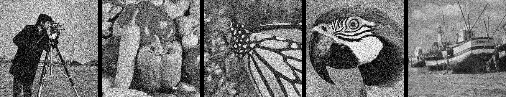
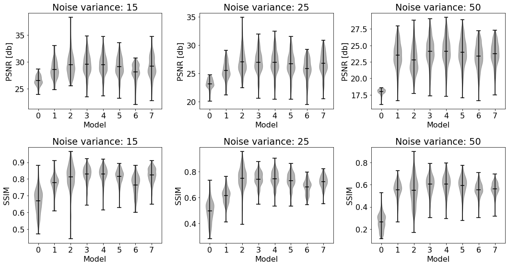

# Learning diffusion functions for reconstruction problems

This project is an implementation for my master thesis on image reconstruction which has the same title. Input images are supposed to be in grayscale, be square and have been corrupted by a Gaussian noise with three possible variances: 15, 25 and 50.
It was done completely in Python and the functions involved were learned using Keras models.

<p float="left">
  
</p>


## Documentation

Below can be found a description of the models involved in this thesis as well as a quickstart installation and usage example.

<details open>
  <summary>Install</summary>

  Clone this repository and pip install all the needed packages using the [requirements](requirements.txt)
  ```
pip install -r requirements.txt
  ```
and move to the created folder.
</details>

<details open>
  <summary>Description and usage</summary>

Below, you can find a description of the mathematical model behind the different models as well as examples of usage.

<details>
  <summary>Perona-Malik model</summary>
This work is based on the differential equation with boundary and initial conditions introduced by [Perona and Malik](https://ieeexplore.ieee.org/document/56205) $$u_t = \text{div}(a(|\nabla u|^2)\nabla u)$$ where $u_0$ is a given image as initial condition meant to 
be reconstructed and $a$ is a function for which the authors proposed the options $$a(s) = \exp(-(s/K)^2)$$ and $$a(s)=\frac{1}{1+(s/K)^2}$$ with $K$ being a scalar parameter.

The idea behind is that $a$ is a function which generating diffusion in such a way that the noise will be blured out while preserving the borders of the image, distinguishing what is to be done in each pixel by using the gradient's norm.

This model can be used directly in the command line
  ```
python anisotropic_diffusion.py --architecture PeronaMalik --images <folder_with_images> --option <1 or 2>
  ```
or in a Python environment.
```
from anisotropic_diffusion import diffusor
import cv2
from glob import glob
import numpy as np


model = diffusor('PeronaMalik')
images = glob('./Set11/*')[0] #Example of image to reconstruct
images = cv2.cvtColor(cv2.imread(images), cv2.COLOR_BGR2GRAY)
images = np.expand_dims(images,axis=-1) #Not necessary, but to add the number of channels
reconstructed = model(images, option=1, niter=10) #Reconstruction process
  ```

</details>

<details>
  <summary>Automation of $K$</summary>

One generalization one can make for this model is turning $K$ from a scalar to a function taking the initial condition as its argument. This can be run in the command lne with 
 ```
 python anisotropic_diffusion.py --architecture KAutomation --images <folder_with_images> --option 2 --variance <15, 25 or 50>
  ```
or in a Python environment as
```
from anisotropic_diffusion import diffusor
import cv2
from glob import glob
import numpy as np

"""
Available options are 1 and 2
Available variances are 15, 25 and 50

If no option is provided and variance is, it returns a trained model using the non-exponential diffusivity.
If option is provided, it returns the untrained desired architecture.
If variance nor option are provided, it returns an untrained model using the non-exponential diffusivity
"""

model = diffusor('KAutomation', option=1, crop=256, variance=15)
images = glob('./Set11/*')[0]
images = np.reshape(cv2.cvtColor(cv2.imread(images), cv2.COLOR_BGR2GRAY), (1, 256, 256, 1))
reconstructed = model(images)
  ```
</details>

<details>
  <summary>Fields of Experts (FoE)</summary>

If instead of using the gradient's norm to distinguish where is to be blured and where to be preserved we would use a convolutional layer with several filters and assign a learnt activation function to each of them, we would have a generalization of the FoE model proposed by
[Roth and Black](https://ieeexplore.ieee.org/document/1467533), which can be expressed using the equation 

$$u_t = \text{div}\left(\left(\sum\limits_{n=0}^Na_n(\mathcal{D}_n u)\right)\nabla u\right).$$

The function spaces from were we learned our functions were: splines of order 1, decreasing splines of order 1, monomials and the family of functions used by Roth and Black. To run it in the command line you can write

```
 python anisotropic_diffusion.py --architecture FoE --function_type <splines, decreasing, monomials or RothBlack> --images <folder_with_images>--variance <15, 25 or 50>
  ```
while for a Python environment it would be enough to type
```
from anisotropic_diffusion import diffusor
import cv2
from glob import glob
import numpy as np

"""
Available function_type are splines, decreasing, monomials and RothBlack.
Available variances are 15, 25 and 50.

If no funtion_type is provided, it returns None
If degree nor num_filters are not provided but variance is, it returns a trained model.
If degree and num_filters are provided, it returns an untrained model with the desired architecture.
Else, return None
"""

model = diffusor('FoE', function_type='splines', crop=256, variance=15)
images = glob('./Set11/*')[0]
images = np.reshape(cv2.cvtColor(cv2.imread(images), cv2.COLOR_BGR2GRAY), (1, 256, 256, 1))
reconstructed = model(images)
  ```
</details>

<details>
  <summary>U-Net</summary>

The last generalization we tried for this equation was to follow the equation $$u_t-\operatorname{div}(\mathcal{U} (u)\nabla u)=0 were $\mathcal{U}$$ was a U-Net. To use this in the command line, type
```
 python anisotropic_diffusion.py --architecture UNet --images <folder_with_images> --variance <15, 25 or 50>
  ```
while if using a Python environment, use 

```
from anisotropic_diffusion import diffusor
import cv2
from glob import glob
import numpy as np

"""
Available variances are 15, 25 and 50.

If funtion_type is provided, it returns None
If degree nor depth are not provided but variance is, it returns a trained model.
If degree and depth are provided, it returns an untrained model with the desired architecture.
Else, return None
"""

model = diffusor('UNet', crop=256, variance=15)
images = glob('./Set11/*')[0]
images = np.reshape(cv2.cvtColor(cv2.imread(images), cv2.COLOR_BGR2GRAY), (1, 256, 256, 1))
reconstructed = model(images).numpy()[0]
  ```
</details>

</details>

## Models
The [BSDS500](https://www2.eecs.berkeley.edu/Research/Projects/CS/vision/bsds/) dataset was used to train and test out models. Below you can find the validation results.

<details>
  <summary>Perona-Malik</summary>


|  Noise variance | PSNR input | PSNR output | SSIM input | SSIM output | 
| --------------- | ---------- | ----------- | ---------- | ----------- |
| 15              | 24.61      |   28.58     | 0.59       | 0.78        | 
| 25              | 20.17      |   25.53     | 0.41       | 0.62        | 
| 50              | 14.15      |   23.39     | 0.2        | 0.55        | 

</details>

<details>
  <summary>Automation of K</summary>
  
|  Noise variance | PSNR input | PSNR output | SSIM input | SSIM output | 
| --------------- | ---------- | ----------- | ---------- | ----------- |
| 15              | 24.61      |   29.49     | 0.59       | 0.83        | 
| 25              | 20.17      |   26.76     | 0.41       | 0.72        | 
| 50              | 14.15      |   23.48     | 0.2        | 0.55        | 


</details>

<details>
  <summary>FoE using splines of order 1</summary>
  
|  Noise variance | PSNR input | PSNR output | SSIM input | SSIM output | 
| --------------- | ---------- | ----------- | ---------- | ----------- |
| 15              | 24.61      |   29.5      | 0.59       | 0.83        | 
| 25              | 20.17      |   26.99     | 0.41       | 0.74        | 
| 50              | 14.15      |   24.16     | 0.2        | 0.6        | 


</details>

<details>
  <summary>U-Net</summary>
  
|  Noise variance | PSNR input | PSNR output | SSIM input | SSIM output | 
| --------------- | ---------- | ----------- | ---------- | ----------- |
| 15              | 24.61      |   29.26     | 0.59       | 0.83        | 
| 25              | 20.17      |   27.18     | 0.41       | 0.76        | 
| 50              | 23.96      |   24.16     | 0.2        | 0.59        | 


</details>


<details>
  <summary>Comparison performance</summary>


</details>

## License

This code is an open-source project under the [AGPL-3.0 License](LICENSE.txt).
